##Dokumentasi Perancangan Keamanan Sistem dan Jaringan

>###Penulis
>* M. Syaiful Jihad A.&nbsp;&nbsp;&nbsp;&nbsp;&nbsp;&nbsp;&nbsp;5113100022
>* Yoga Bayu Aji P.&nbsp;&nbsp;&nbsp;&nbsp;&nbsp;&nbsp;&nbsp;&nbsp;&nbsp;&nbsp;5113100023
>* Bagas Andita S.&nbsp;&nbsp;&nbsp;&nbsp;&nbsp;&nbsp;&nbsp;&nbsp;&nbsp;&nbsp;&nbsp;5113100029

##Percobaan serangan Brute-Force pada SSH Server

##Simulasi dan skema serangan
&nbsp;&nbsp;&nbsp;&nbsp;&nbsp;&nbsp;&nbsp;&nbsp;Percobaan yang akan dibuat adalah melakukan _brute-force attack_ pada sebuah sever yang dipasang ssh server. Percobaan dilakukan dengan dua environment yang berbeda. Environment pertama server yang digunakan tidak dilakukan suatu apapun untuk mencegah serangan. Environment kedua pada server akan ditambahkan konfigurasi dan aplikasi yang bertujuan untuk mencegah serangan yang dilakukan.

###Sekenario 1
&nbsp;&nbsp;&nbsp;&nbsp;&nbsp;&nbsp;&nbsp;&nbsp;Disini kita menggunakan sebuah host dengan sistem operasi Ubuntu Server 14.04 yang telah terinstall openSSH-server. Sistem operasi ini akan digunakan sebagai target serangan. Kemudian digunakan sistem operasi Kali Linux yang akan digunakan sebagai komputer penyerang.
SSH server dan sistem operasi yang digunakan masih dalam keadaan default tanpa ada Firewall maupun konfigurasi untuk melakukan pencegaran terharap serangan.

&nbsp;&nbsp;&nbsp;&nbsp;&nbsp;&nbsp;&nbsp;&nbsp;a. Instalasi host dengan menggunakan Virtualbox.

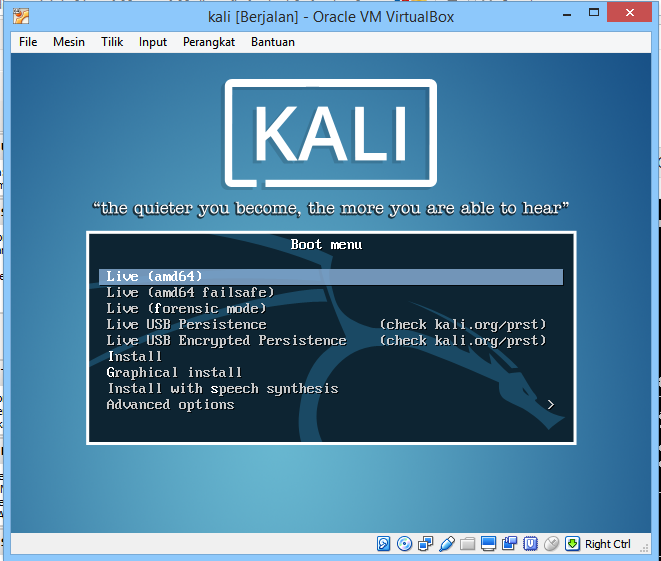;&nbsp;&nbsp;;&nbsp;&nbsp;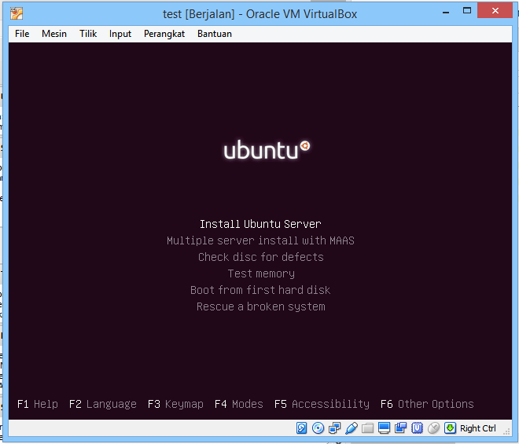

&nbsp;&nbsp;&nbsp;&nbsp;&nbsp;&nbsp;&nbsp;&nbsp;Sebelum melakukan serangan kita harus menyiapkan kedua buah sistem operasi yang akan digunakan untuk simulasi. Pertama kita menginstall dulu ubuntu server 14.04. Setelah itu install openSSH-server pada sistem operasi tersebut. 
```
$ sudo apt-get install openssh-server
```
&nbsp;&nbsp;&nbsp;&nbsp;&nbsp;&nbsp;&nbsp;&nbsp;Setelah server yang akan menjadi korban serangan siap, kita melakukan instalasi sistem operasi untuk penyerang. Pada komputer penyerang kita akan menggunakan beberapa tools yaitu: _Hydra, Ncrack,_ dan _Medusa._
 
&nbsp;&nbsp;&nbsp;&nbsp;&nbsp;&nbsp;&nbsp;&nbsp;b. Setting alamat IP untuk masing-masing host sehingga dapat saling terhubung satu sama lain.
>IP penyerang &nbsp;&nbsp;&nbsp;&nbsp;10.151.36.115

>IP korban &nbsp;&nbsp;&nbsp;&nbsp;&nbsp;&nbsp;&nbsp;&nbsp;&nbsp;&nbsp;10.151.36.120

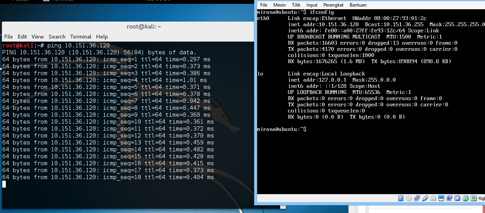

&nbsp;&nbsp;&nbsp;&nbsp;&nbsp;&nbsp;&nbsp;&nbsp;Langkah selanjutnya pastikan antara sever korban dan penyerang sudah terhunung.
Dari sisi penyerang, kita akan melakukan test dahulu apakah port SSH dari server terbuka dengan menggunakan nmap.
```
# nmap -sV [_IP address korban_]
```
&nbsp;&nbsp;&nbsp;&nbsp;&nbsp;&nbsp;&nbsp;&nbsp;Pastikan port ssh(22) terbuka agar kita dapat melakukan serangan kepada server.

&nbsp;&nbsp;&nbsp;&nbsp;&nbsp;&nbsp;&nbsp;&nbsp;c. Melakukan simulasi serangan brute-force SSH dengan menggunakan aplikasi Hydra dan Ncrack.

&nbsp;&nbsp;&nbsp;&nbsp;&nbsp;&nbsp;&nbsp;&nbsp;Sebelum melakukan serangan kita membutuhkan sebuah _dictionary-passwords_ yang digunakan untuk mencoba password yang cocok untuk masuk kedalam server. Disini kita mencoba menggunakan _500-worst-password.txt_ dari [skullsecurity](http://downloads.skullsecurity.org/passwords). 

####Uji serangan
- **Hydra**

Perintah yang digunakan untuk menjalankan Hydra adalah:
```
hydra -l [username] -v -t 7 -P [pass_dictionary] [host_target] ssh
```
```
# hydra -l mirana -v -t 7 -P 500-worst-passwords.txt 10.151.36.120 ssh
```

>-l&nbsp;&nbsp;&nbsp;&nbsp;Option untuk memasukkan username

>-t&nbsp;&nbsp;&nbsp;&nbsp;Memberikan delay serangan

>-P&nbsp;&nbsp;&nbsp;Membaca password dari file

>-p&nbsp;&nbsp;&nbsp;&nbsp;Port yang akan diserang 

Kemudian tunggu proses sampai selesai. Jika berhasil maka akan terlihat seperti pada gambar dibawah ini.

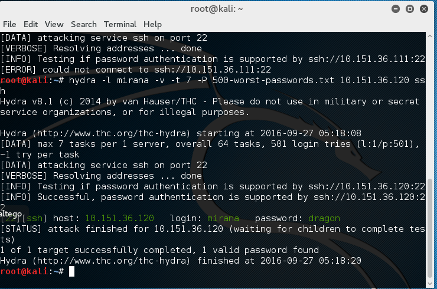

- **Ncrack**

Perintah untuk melakukan serangan dengan menggunakan aplikasi Ncrack adalah:
```
ncrack -p [servicelist] -u [user_name] -P [pass_dictionary] -T[0-5] [host_target]
```
```
# ncrack -p ssh -u mirana -P 500-worst-passwords.txt T5 10.151.36.120
```

>-p&nbsp;&nbsp;&nbsp;&nbsp;Pemilihan service yang akan diserang

>-u&nbsp;&nbsp;&nbsp;&nbsp;Option untuk memasukkan username

>-P&nbsp;&nbsp;&nbsp;&nbsp;Membaca password dari file

>-T&nbsp;&nbsp;&nbsp;&nbsp;Timing template untuk serangan

Hasil yang akan ditampilkan adalah sebagai berikut:

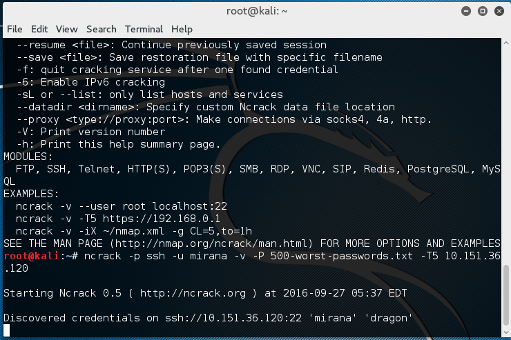

- **Medusa**

Perintah untuk melakukan serangan dengan aplikasi Medusa adalah:
```
medusa -u [username] -P [pass_dictionary] -h [host_target] -M [modul]
```
```
# medusa -u mirana -P 500-worst-password.txt -h 10.151.36.120 -M ssh
```

>-u&nbsp;&nbsp;&nbsp;&nbsp;Username dari yang diserang

>-P&nbsp;&nbsp;&nbsp;&nbsp;Membaca password dari file

>-h&nbsp;&nbsp;&nbsp;&nbsp;Host target

>-M&nbsp;&nbsp;&nbsp;&nbsp;Modul serangan yang digunakan

Hasilnya akan seperti dibawah ini:

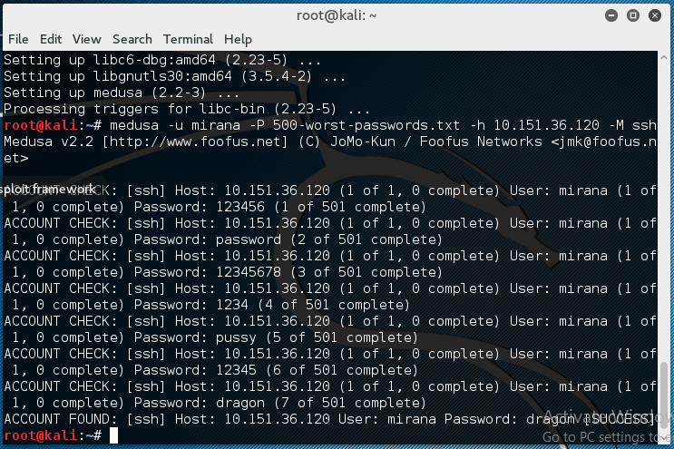

>PS: _diasumsikan username sudah diketahui oleh penyerang._

>jika mengalami masalah seperti di bawah
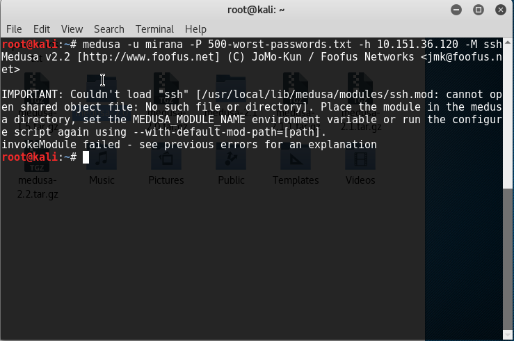

>Lakukan perintah copy :
```
# cp -i /usr/lib/medusa/modules/ssh.mod /usr/local/lib/modules/
```

##Sekenario 2

&nbsp;&nbsp;&nbsp;&nbsp;&nbsp;&nbsp;&nbsp;&nbsp;Percobaan yang dibuat adalah melakukan serangan _bruteforce_ kepada server dengan alamat IP 10.151.36.120 yang sebelumnya telah dikonfigurasi dengan instalasi _fail2ban_ dan merubah konfigurasi _default ssh_.

####**Uji Serangan**
- **Install _fail2ban_ **
Langkah pertama adalah melakukan instalasi _fail2ban_ dengan menggunakan syntax :
```**
apt-get install fail2ban
```
Kemudian dicoba diserang menggunakan _hydra_ diperoleh hasil sebagai berikut :

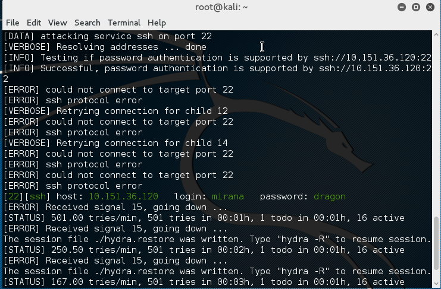

Dari hasil tersebut dapat diamati bahwa **_ssh protocol error_** namun **_username_** dan **_password_** masih dapat ditemukan.
- **Konfigurasi _ssh_**
Langkah selanjutnya kemudian melakukan konfigurasi _ssh_ yaitu dengan merubah _port_ yaitu menjadi _port_ **666**

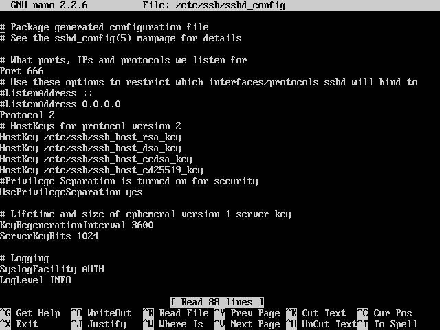

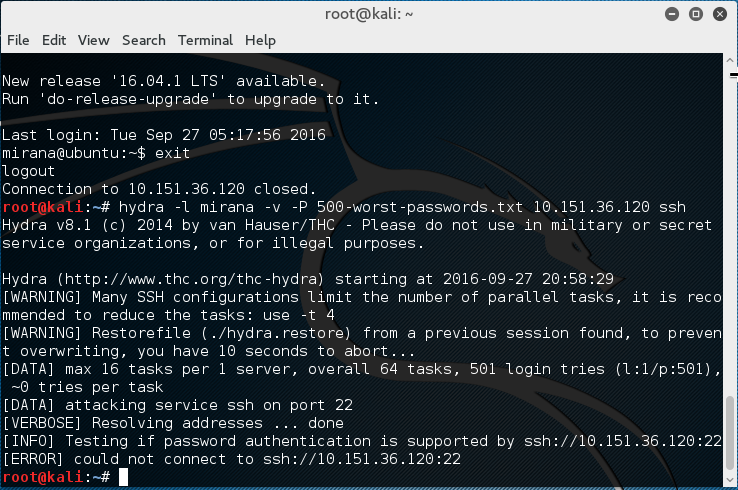

Dari hasil percobaan tersebut dapat dilihat bahwa _tools hydra_ tidak dapat melakukan _bruteforce_ pada _port_ yang telah kita ganti.
- **_Setting Login Attempt_**
Langkah selanjutnya adalah melakukan konfigurasi _fail2ban_ untuk membatasi batas _login_ sampai 3 kali.

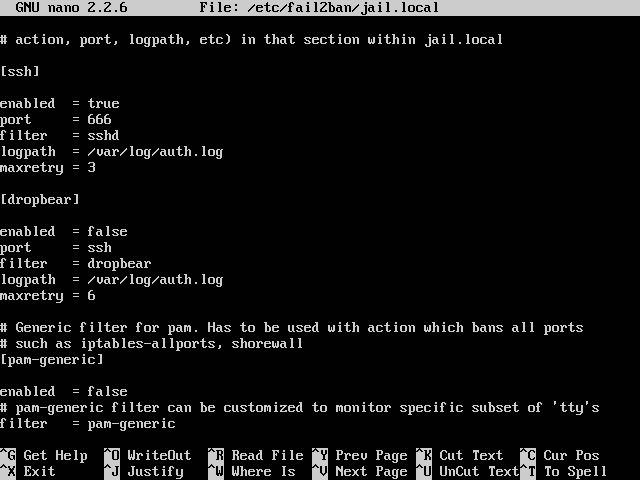

dari gambar tersebut dilakukan perubahan pada baris _maxretry_ yaitu 3 untuk melakukan pembatasan _login_ selama 3 kali.
Hasil pengujian serangannya didapatkan hasil sebagai berikut :

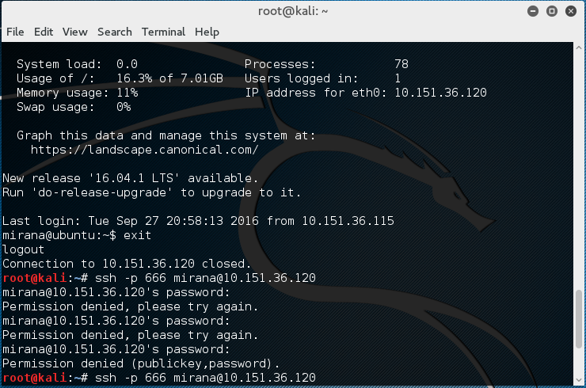

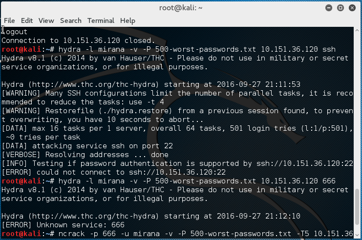

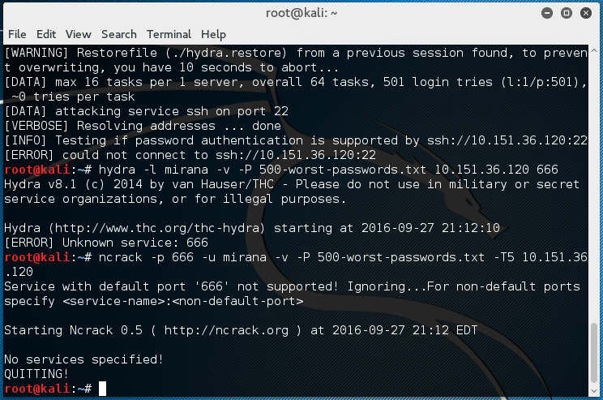
