##Dokumentasi Perancangan Keamanan Sistem dan Jaringan

>###Penulis
>* M. Syaiful Jihad A.&nbsp;&nbsp;&nbsp;&nbsp;&nbsp;&nbsp;&nbsp;5113100022
>* Yoga Bayu Aji P.&nbsp;&nbsp;&nbsp;&nbsp;&nbsp;&nbsp;&nbsp;&nbsp;&nbsp;&nbsp;5113100023
>* Bagas Andita S.&nbsp;&nbsp;&nbsp;&nbsp;&nbsp;&nbsp;&nbsp;&nbsp;&nbsp;&nbsp;&nbsp;5113100029

##Percobaan Serangan pada Plugins CMS Wordpress

##Simulasi dan skema serangan
&nbsp;&nbsp;&nbsp;&nbsp;&nbsp;&nbsp;&nbsp;&nbsp;Percobaan kali ini akan melakukan serangan pada celah keamanan yang ada pada plugin wordpress. Alat yang digunakan menggunakan wordpress versi 4.0. Kemudian akan diinstall beberapa plugin yang memiliki celah keamanan.

###Persiapan
&nbsp;&nbsp;&nbsp;&nbsp;&nbsp;&nbsp;&nbsp;&nbsp;Pertama kita siapkan dulu CMS Wordpress yang akan digunakan. CMS dapat diunduh dari link [berikut](http://https://wordpress.org/download/).

####Langkah Installasi
&nbsp;&nbsp;&nbsp;&nbsp;&nbsp;&nbsp;&nbsp;&nbsp;Persiapan untuk melakukan installasi wordpress:
- Web Server (Apache)
- Database (MySQL)
- PHP (5.6)

Sebelum melakukan installasi wordpress, kita persiapkan database dan usernya terlebih dahulu. Pada percobaan kali ini didapatkan konfigurasi sebagai berikut
>Database: wordpress
>DB Username: wordpressuser
>DB Password: wppasswd

Setelah semua terinstall maka extract CMS wordpress yang sudah kita download tadi kedalam folder /var/www/html. Setelah itu buat file konfigurasi wordpress. Dalam wordpress sudah disediakan contoh file konfigurasi sehingga kita dapat menggunakannya.
```
cp wp-config-sample.php wp-config.php
```
Setelah itu kita edit file ++wp-cinfig.php++ dan masukan konfigurasi koneksi database seperti pada gambar dibawah

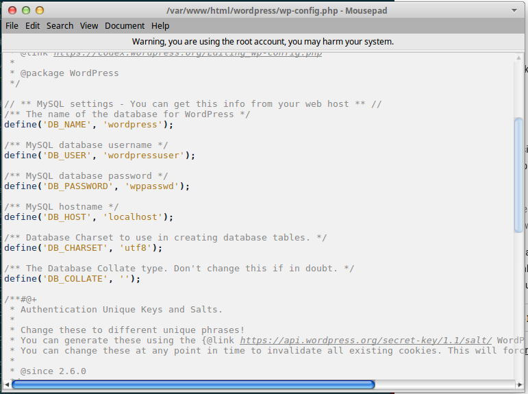

Setelah itu kita buka wordpress dari web browser dan masukkan konfigurasi password admin login dan nama website. Username yang digunakan:
>Username: testing
>Password: testing

Setelah semua konfigurasi selesai, kita menginstall plugin yang akan kita pasang dan melakukan uji coba serangan. Cara menginstallasi plugin tersebut, kita meletakkan plugin yang sudah kita download kedalam folder wp-content/plugins/. Setelah itu kita masuk kedalam dashboard admin pada wordpress dan melakukan aktivasi plugin yang sudah kita install.

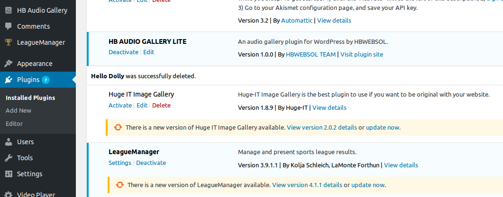

###Uji Coba Serangan
&nbsp;&nbsp;&nbsp;&nbsp;&nbsp;&nbsp;&nbsp;&nbsp;Untuk melakukan uji coba serangan plugin wordpress, kali ini kita menggunakan Sistem Operasi Kali Linux. Setelah melakukan installasi, kita melakukan enumerasi terhadap target untuk mengetahui apa saja celah keamanan yang ada pada website tersebut. Tools yang digunakan adalah [WPScan](http://wpscan.org). Untuk melakukan enumerasi gunakan perintah:
```
wpscan --url http://target.com --enumerate
```
```
# wpscan --url http://10.151.36.38/wordpress --enumerate
```

Maka akan muncul seperti ini:

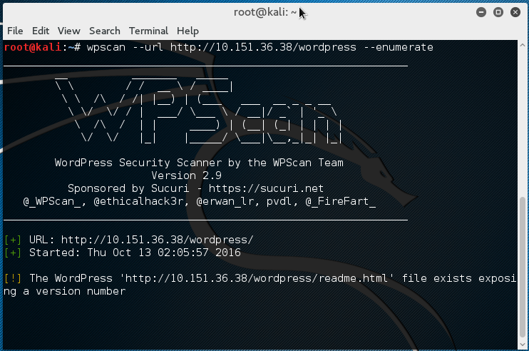

####Uji Coba Dengan Plugin Video Player 1.5.16
berikut ini adalah tampilan plugin video player 1.5.16
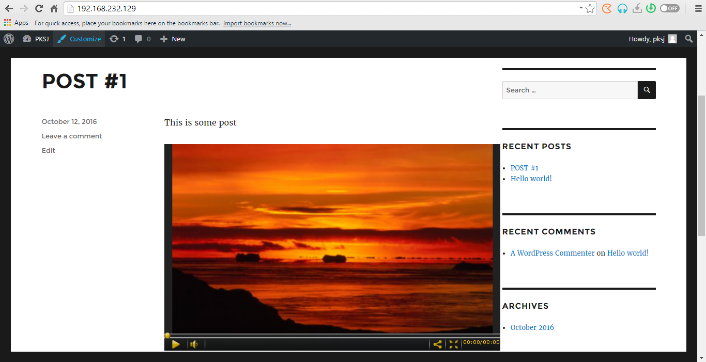

uji coba menggunakan wpscan didapati hasil sebagai berikut

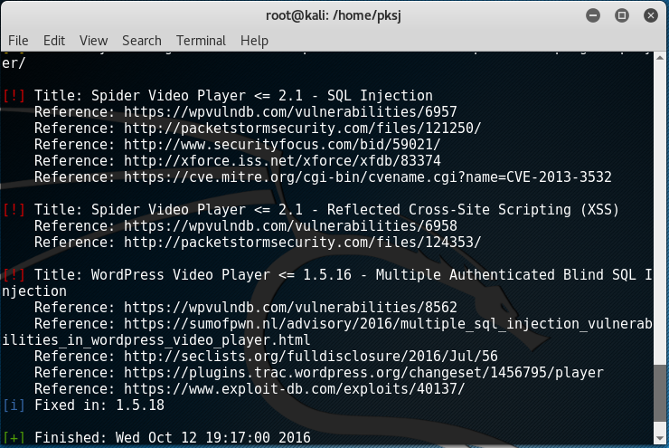

kemudian akan ditemukan sebuah username yang digunakan untuk login pada website seperti berikut ini :

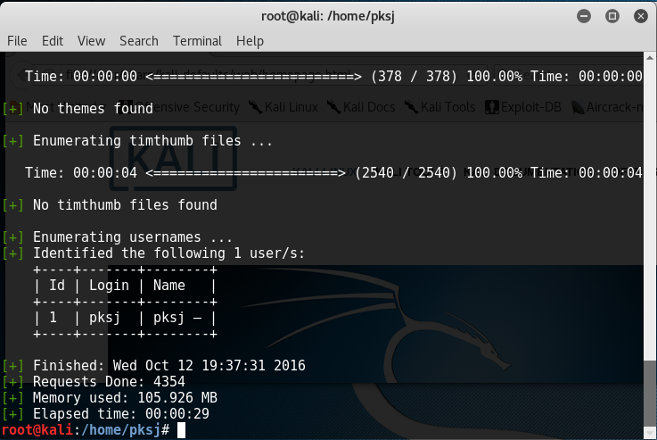
catatan : alamat website adalah alamat website berbeda (dengan IP address 192.168.232.129)

####Uji Coba Menggunakan League Manager 3.9.1.11
Pada tahap ini dilakukan instalasi plugin league manager versi 3.9.1.11. berikut ini adalah tampilan plugin league manager 3.9.1.11 ketika sudah diaktifkan :

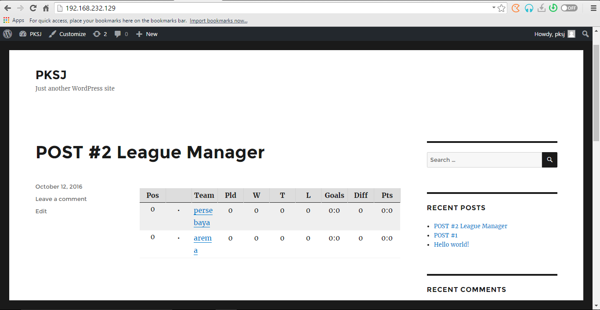

uji coba menggunakan wpscan didapati hasil sebagai berikut

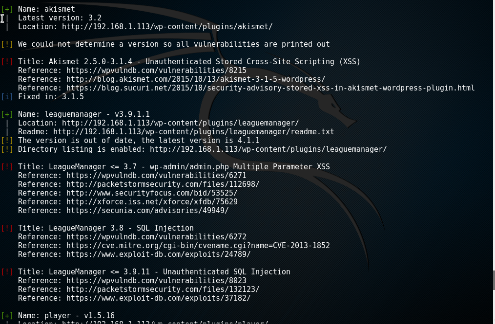

Pada uji coba ini dihasilkan hasil yang sama seperti ketika menggunakan plugin video player 1.5.16

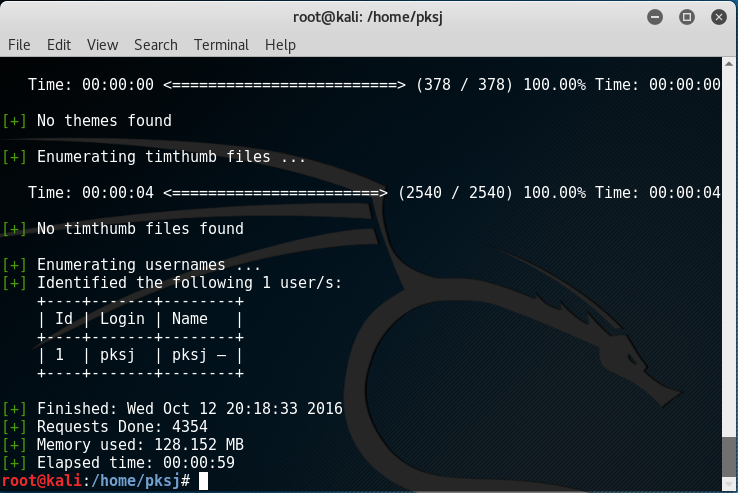

####Uji Coba Menggunakan WP Ultimate Explorer 1.1
Pada tahap ini dilakukan instalasi plugin WP Ultimate Explorer versi 1.1. berikut ini adalah tampilan plugin WP Ultimate Explorer versi 1.1 ketika sudah diaktifkan :

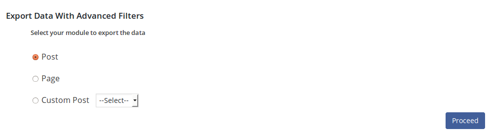

uji coba menggunakan wpscan didapati hasil sebagai berikut

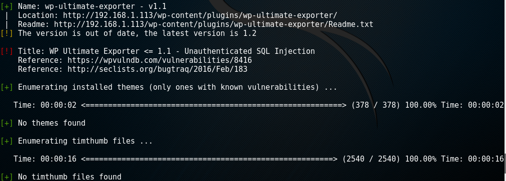

####Uji Coba Menggunakan WP Symposium 15.1

uji coba menggunakan wpscan didapati hasil sebagai berikut

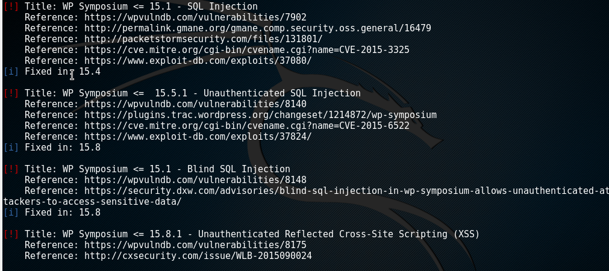

####Uji Coba Serangan SQL Injection

