###PENDAHULUAN

sandbox adalah mekanisme keamanan untuk memisahkan program yang sedang berjalan. Istilah ini acap digunakan untuk mengeksekusi kode yang belum diuji, atau program tidak terpercaya yang berasal dari pihak ketiga dan pemasok yang tidak terverifikasi, serta pengguna dan situs web yang tidak terpercaya.

Malware adalah setiap program atau file yang berbahaya (malicious software”) bagi pengguna komputer. Dengan demikian, malware termasuk virus komputeres, worm, Trojan horse , dan juga spyware termasuk malware.

Cuckoo Sandbox adalah malware analysis system yang digunakan untuk menganalisis file yang mencurigakan. Cuckoo akan memberikan hasil yang detail apa yang terjadi saat file dijalankan di dalam lingkungan yang terisolasi.

###Instalasi Cuckoo SandBox

####Install Required Package

```$ sudo apt-get install git mongodb libffi-dev build-essential python-django python python-dev python-pip python-pil python-sqlalchemy python-bson python-dpkt python-jinja2 python-magic python-pymongo python-gridfs python-libvirt python-bottle python-pefile python-chardet tcpdump -y ```

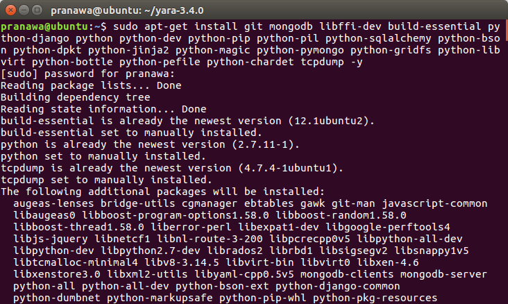

####Configuring Tcpdump

```$ sudo setcap cap_net_raw,cap_net_admin=eip /usr/sbin/tcpdump```

####Installing Yara

```$ sudo apt-get install autoconf libtool libjansson-dev libmagic-dev libssl-dev -y```
```$ wget https://github.com/plusvic/yara/archive/v3.4.0.tar.gz -O yara-3.4.0.tar.gz```
```$ tar -zxf yara-3.4.0.tar.gz```
```$ cd yara-3.4.0```
```$ ./bootstrap.sh```
```$ ./configure --with-crypto --enable-cuckoo --enable-magic```
```$ make```
```$ sudo make install```

####To build and install the yara-python extension:

```$ cd yara-python```
```$ python setup.py build```
```$ sudo python setup.py install```

####Installing Pydeep

```$ wget http://sourceforge.net/projects/ssdeep/files/ssdeep-2.13/ssdeep-2.13.tar.gz/download -O ssdeep-2.13.tar.gz```
```$ tar -zxf ssdeep-2.13.tar.gz```
```$ cd ssdeep-2.13```
```$ ./configure```
```$ make```
```$ sudo make install```

####Installing Volatility

```$ pip install openpyxl```
```$ pip install ujson```
```$ pip install pycrypto```
```$ pip install distorm3```
```$ pip install pytz ```

```$ git clone https://github.com/volatilityfoundation/volatility.git```
```$ cd volatility```
```$ python setup.py build```
```$ python setup.py install```

####Installing Cuckoo

```$ git clone git://github.com/cuckoosandbox/cuckoo.git```
```$ useradd cuckoo```
```$ sudo chown -R cuckoo:cuckoo /home/$USER/cuckoo```

####Configuring Cuckoo

cuckoo.conf

machinery = virtualbox

[resultserver]
ip = 192.168.56.1 #IP Address host
port = 2042 #default setting

auxiliary.conf
```
[sniffer]
Enable or disable the use of an external sniffer (tcpdump) [yes/no].
enabled = yes

Specify the path to your local installation of tcpdump. Make sure this
# path is correct.
# You can check this using the command: whereis tcpdump
tcpdump = /usr/sbin/tcpdump

# Specify the network interface name on which tcpdump should monitor the
# traffic. Make sure the interface is active.
# The ifconfig command will show you the interface name.
interface = vboxnet0

virtualbox.conf

machines = windowsxp

[windowsxp]
label = windowsxp
platform = windows
ip = 192.168.56.10 # IP Adress guest
snapshot = snapshot1 # nama snapshot

reporting.conf

[mongodb]
enabled = yes
```
####Saatnya Run Cuckoo Sandbox

````$ cd /home/cuckoo/cuckoo```
```$ python cuckoo.py```

###Percobaan Analysa Malware

####Persiapan

Untuk kali ini kita akan mencoba menganalisis apa yang dilakukan malware yang sudah didapatkan dari website [malwr](http://malwr.com). Malware yang akan kita coba diantaranya:
- pdfforge Toolbar-4_4_0_setup.exe
- pdf_creator.exe 
- malware-windows.exe 

Untuk mengunggah malware dan menjalankannya, dapat mengeksekusi file submit.py. Perintahnya:
```
./submit.py [nama_file_malware]
```

Setelah itu aplikasi cuckoo akan menjalankan virtualisasi windows dan mencatat segala perubahan yang terjadi.

Jika proses eksekusi sudah selesai, hasil dari eksekusi dapat dilihat dari website monitoring yang sudah disediakan cuckooo pada alamat localhost:8000, seperti gambar dibawah ini:

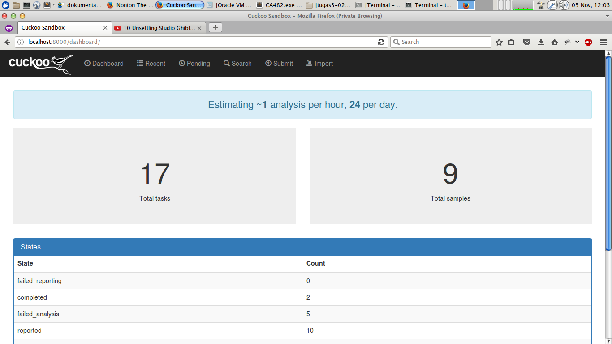

Kemudian buka pada tab Recent. Akan muncul history dan detail dari analisis yang sudah pernah dilakukan.

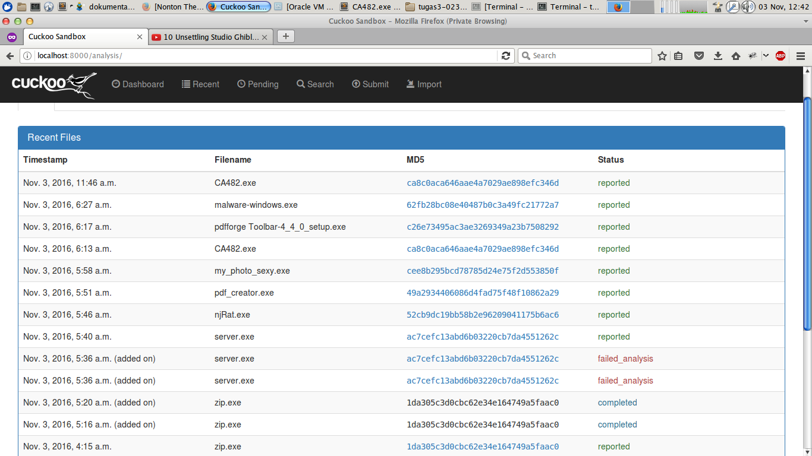

**Hasil malware-windows.exe **

Malware ini melakukan eksekusi perintah pada Command lince windows dan memunculkan pesan pada cmd.

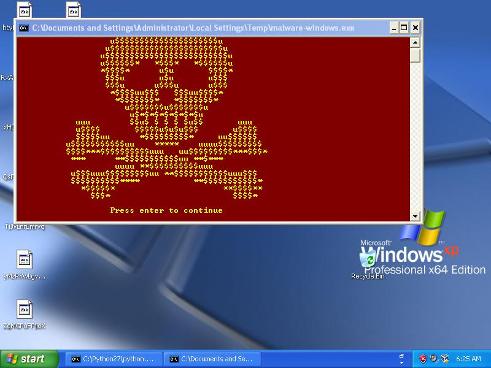

Selain itu juga malware tersebut melakukan perubahan pada registery windows seperti pada gambar dibawah ini:

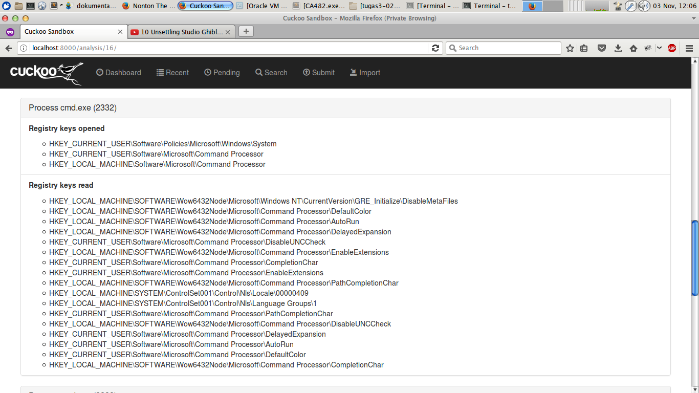

**Hasil pdfforge Toolbar-4_4_0_setup.exe **

Malware ini melakukan installasi pdfforge dan mengakses alamat web yang sudah diset dari malware tersebut.
Hasil analisisnya seperti:

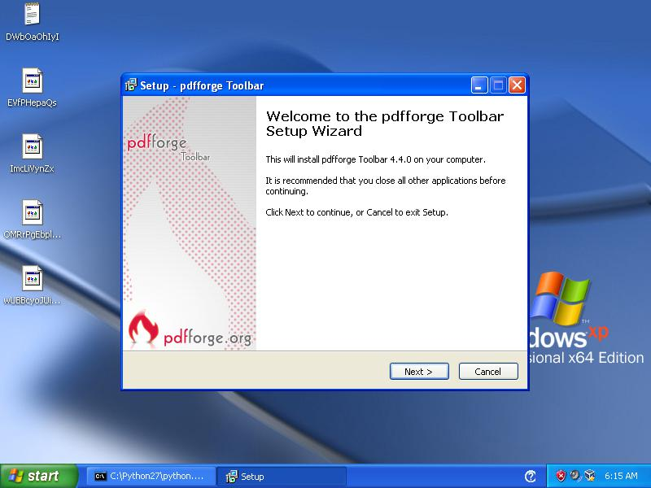


Malware ini juga mwlakukan perubahan pada registry seperti gambar dibawah ini:

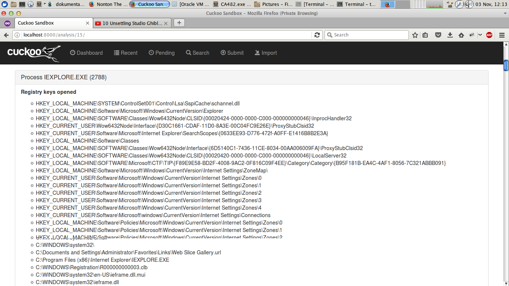

Malware ini juga melakukan kontak dan mengakses beberapa alamat IP seperti dibawah ini:

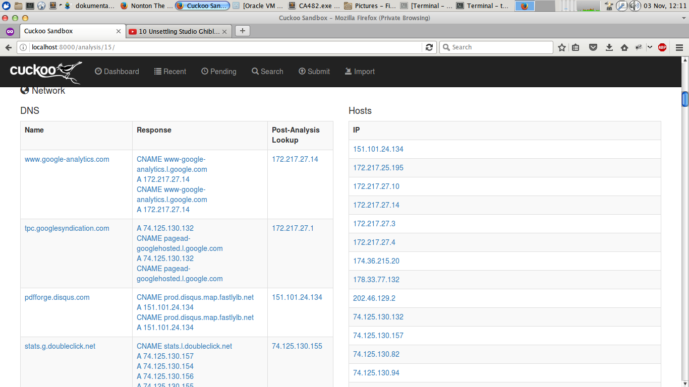

dan proses yang dijalankan oleh malware ini antara lain:

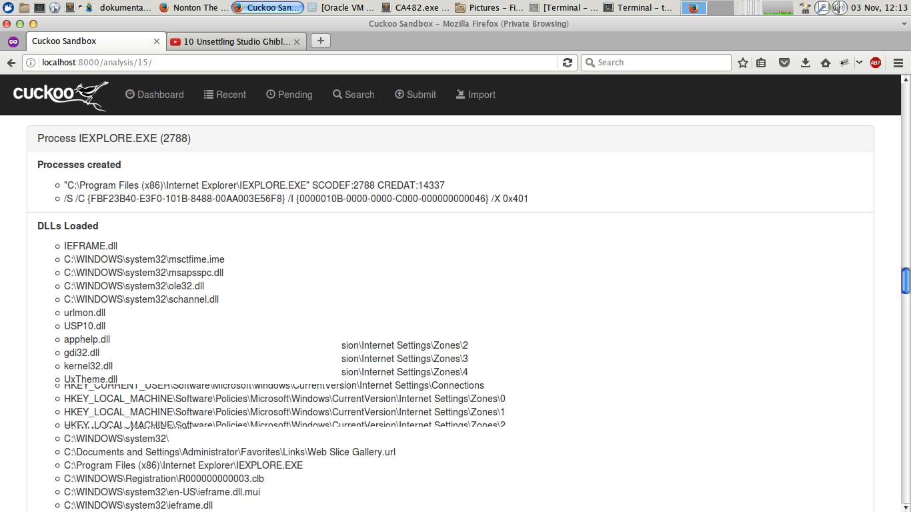

**Hasil pdf_creator.exe **

Malware ini akan melakukan eksekusi installasi Net Framework 2.0.

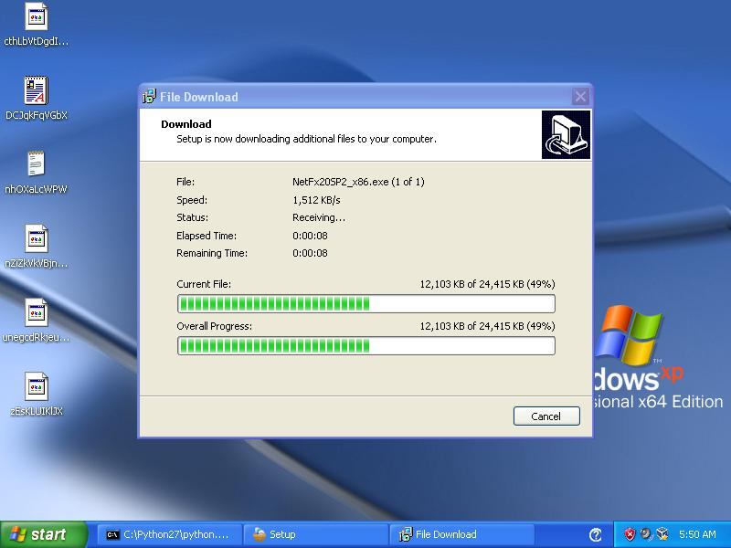

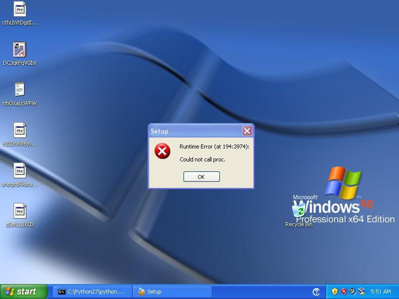

Malware ini juga melakukan akses internet seperti gambar dibawah ini:

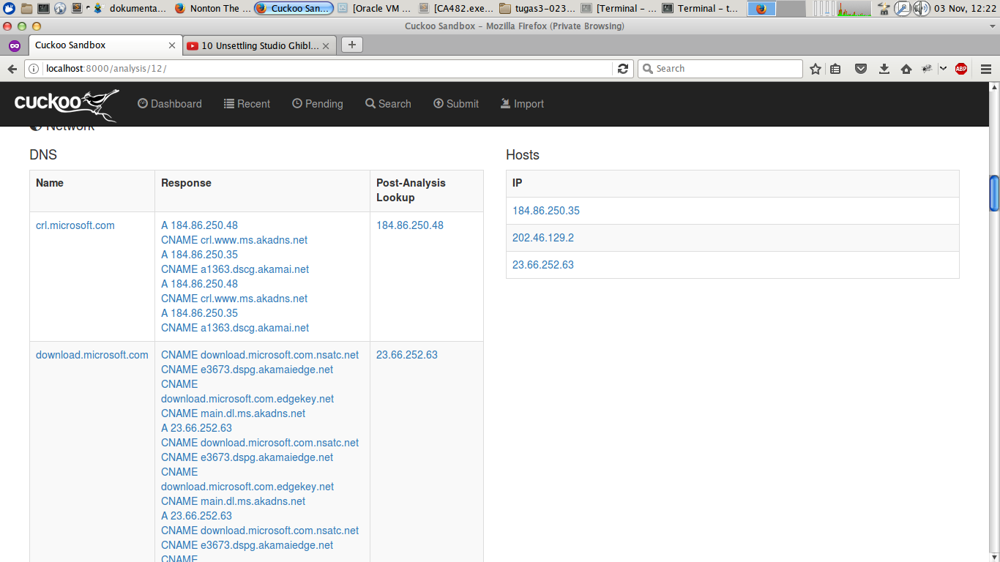

Files yang diakses antara lain:

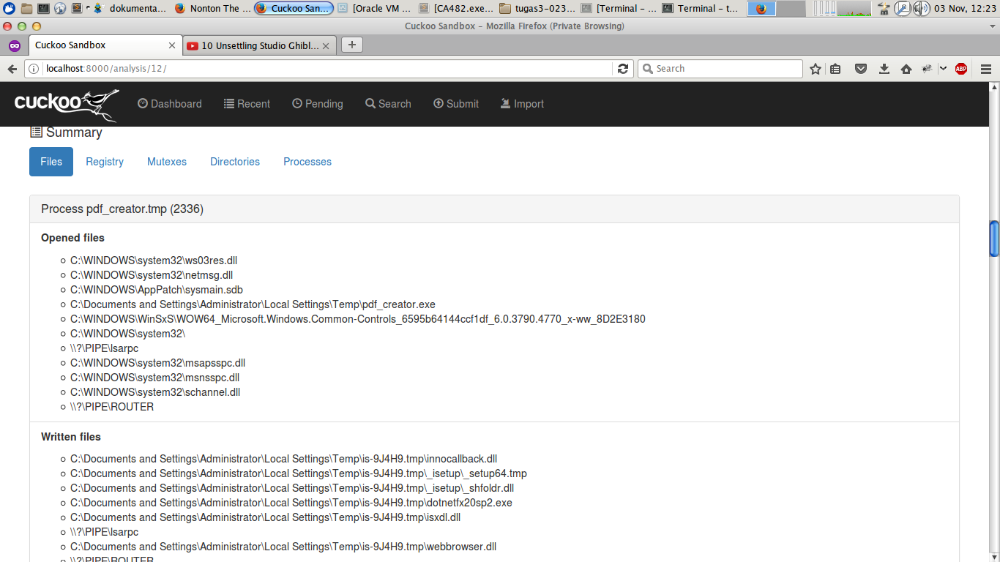

Registery yang diakses maupun diganti antara lain:

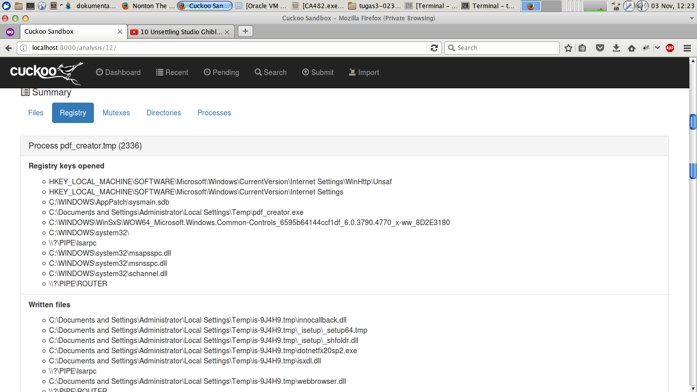

dan proses yang dijalankan antara lain:

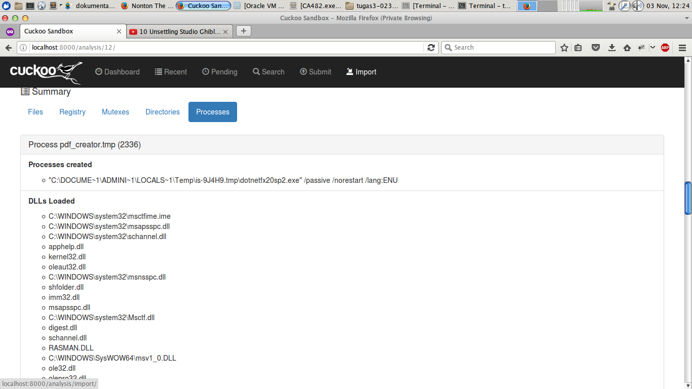

dan melakukan perubahan pada registry seperti gambar:


